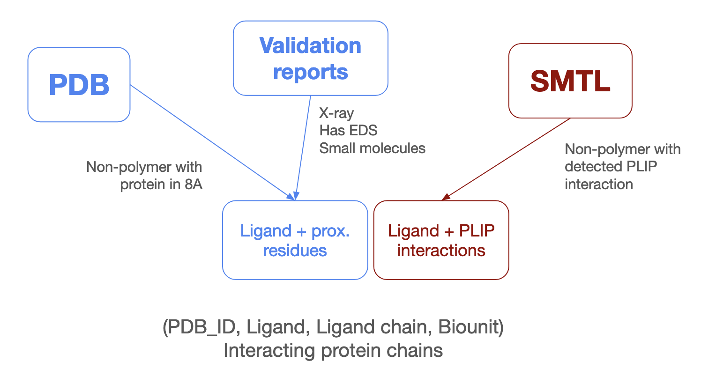
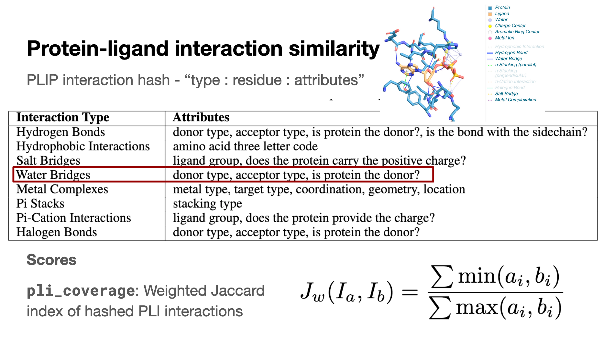

# Protein-Ligand Complex Prediction Dataset

## Overview

### Sources of pockets


1. PDB - See `extract_cif_data.py`. For all non-polymer chains in the PDB, all polymer chain residues within 8A of the non-polymer chain, and the center of mass of the non-polymer chain are extracted. (This is done at the biounit level)
2. Validation criteria - See `extract_validation_data.py`. Information is extracted for each pocket from the PDB validation report. This only applies to pockets from X-ray structures with EDS data (doesn't handle oligosaccharides and oligonucleotides, performed at asymmetric unit level).
3. PLIP - See `extract_plip_data.py`. Annotations detected by PLIP are extracted for each pocket in each biounit from SMTL.

### Annotating pockets
- All pockets and associated info from the 3 sources are merged into a single dataframe, using the PDB_ID, biounit and ligand_mmcif_chain as the key (see `create_dataset.py`)
- Referred to as single ligand pockets (SPLC) - consists of (PDB_ID, biounit, ligand_mmcif_chain, prox_plip_chains)
- Ligands are labeled as (see `label_ligand_types`):
    - cofactor (from PDBe and extra from )
    - drug-like
    - fragment
    - ion
    - oligopeptide
    - oligosaccharide
    - oligonucleotide
    - other
- SPLC are labelled as artifacts if the ligand is present in the BioLiP artifact list and one of
    - Has >15 instances of the same ligand in the same PDB
    - Makes PLIP interactions with < 2 residues
    - Present >2500 times overall
- PDB chains are linked to UniProt IDs and vice versa using the SIFTS database. #TODO: use nextgen
- PDB entries are labeled with oligomeric state and transmembrane presence using SMTL #TODO: use nextgen
- SPLC are merged into multi-ligand pockets (PLC) if they share the same PDB_ID and biounit, and the ligands share a PLIP interaction.
- Subsets are created by
    - filtering out PLC with only ions
    - filtering out PLC with only ions and/or artifacts

A pocket is defined by a PDB_ID, biounit, set of ligand chains and a set of interacting protein chains (i.e those with PLIP interactions to any of the ligand chains).

### Pocket similarity

A Foldseek search is run on all PDB chains (parameters in `run_foldseek.sh`), and the alignments and per-residue lDDT scores are saved.

The following scores are defined (see `extract_scores.py`):
- Protein similarity
    - protein_lddt: lDDT score
    - protein_lddt_qcov: lDDT x query coverage
    - protein_fident: sequence identity
    - protein_qcov: query coverage
- Pocket similarity
    - pocket_qcov: Fraction of shared and aligned pocket residues
    - pocket_fident: Fraction of shared, aligned and identical pocket residues
    - pocket_lddt_qcov: Average lDDT of shared and aligned pocket residues
    - pocket_lddt: Average lDDT of query pocket residues
- PLI similarity


For pockets with >1 protein chain and/or >1 ligand chain, greedy chain mapping is performed using the protein_lddt_qcov for protein chain mapping and the pocket_lddt_qcov for ligand chain mapping. Scores are combined by taking a length-weighted average of the scores for each chain pair, with protein chain length used for protein scores and number of pocket residues used for pocket scores.

### Clustering

For each individual score, a graph is created with nodes as pockets and edges between pockets with a score above a given threshold. This is performed for thresholds of [0.5, 0.7, 0.99] for each score (see `label_protein_pocket_clusters` in `graph_clustering.py`). Connected components are extracted from these graphs and the component ID is added as a column to the dataframe.

### Linking apo and predicted structures
For every UniProt ID associated with a small molecule pocket chain, apo and predicted structures are obtained where available. *Currently only implemented for pockets with a single interacting protein chain*.

All protein chains in the PDB which are not participating in any small molecule pocket are considered for apo structure selection (except for chains in homomeric complexes where a different chain in the complex is participating in a small molecule pocket). There can be multiple apo chains for each UniProt ID. Predicted structures are obtained from AFDB, so there is only one predicted structure per UniProt ID. 

For all apo and predicted structure hits, all protein scores and `pocket_lddt` to each corresponding query pocket are calculated. Only structures with a `protein_qcov` > 0.7 are considered. Apo structures are also annotated with whether the chain has an ion or artifact.

### Columns in the dataframe

See `test.tsv` for an example.
```
# Pocket merging:
pocket_ID
single_pocket_ID			
Pocket_Number	
Pocket_Name	
num_ligands_in_pocket		
ligand_mmcif_chain	
Ligand	
PDB_chain	
PDB_ID				
biounit
joint_pocket_ID	

# Pocket related:
prox_chains	
num_prox_chains	
prox_residues	
center_of_mass
has_pocket

# Validation related:
validation_pocket_ID	
rscc	
rsr	
avgoccu	
altcode	
prox_alternative_configuration_residues_flag	
entry_resolution	
entry_rfree	
entry_r	
entry_clashscore	
entry_percent_rama_outliers	
entry_mean_b_factor	
entry_median_b_factor	
ligand_num_clashes	
entry_r_minus_rfree	
ccd_NumRotatableBonds	
perc_prox_rscc	
iridium_pass	
pass
has_validation

# PLIP related:
plip_pocket_ID	
ligtype
hash
prox_plip_residues
prox_plip_chains	
prox_plip_ligand_chains	
num_prox_plip_chains	
num_prox_plip_residues
num_plip_interactions	
num_unique_plip_interactions
has_plip		

# Ligand related:
ligand_type	
is_biolip_artifact	
is_artifact	
is_ion

# PDB entry related:
method	
oligo_state	
transmembrane	
resolution	
date	
year
protein_chain_lengths

# UniProt related:
UniProt_IDs	
num_uniprot_ids	
num_pdbs_for_uniprots	

# Component identifiers
protein_qcov__0.5__component	protein_qcov__0.7__component	protein_qcov__0.99__component	
protein_fident__0.5__component	protein_fident__0.7__component	protein_fident__0.99__component	
protein_lddt__0.5__component	protein_lddt__0.7__component	protein_lddt__0.99__component	
protein_lddt_qcov__0.5__component	protein_lddt_qcov__0.7__component	protein_lddt_qcov__0.99__component	

pocket_fident__0.5__component	pocket_fident__0.7__component	pocket_fident__0.99__component
pocket_lddt__0.5__component	pocket_lddt__0.7__component	pocket_lddt__0.99__component	
pocket_qcov__0.5__component	pocket_qcov__0.7__component	pocket_qcov__0.99__component	
pocket_lddt_shared__0.5__component	pocket_lddt_shared__0.7__component	pocket_lddt_shared__0.99__component	

plip_weighted_jaccard_nothreeletter__0.25__component	plip_weighted_jaccard_nothreeletter__0.5__component	plip_weighted_jaccard_nothreeletter__0.7__component	plip_weighted_jaccard_nothreeletter__0.99__component
plip_weighted_jaccard_nothreeletterhydrophobic__0.25__component	plip_weighted_jaccard_nothreeletterhydrophobic__0.5__component	plip_weighted_jaccard_nothreeletterhydrophobic__0.7__component	plip_weighted_jaccard_nothreeletterhydrophobic__0.99__component
plip_weighted_jaccard_nowater__0.25__component	plip_weighted_jaccard_nowater__0.5__component	plip_weighted_jaccard_nowater__0.7__component	plip_weighted_jaccard_nowater__0.99__component
plip_weighted_jaccard__0.25__component	plip_weighted_jaccard__0.5__component	plip_weighted_jaccard__0.7__component	plip_weighted_jaccard__0.99__component

plip_jaccard_nothreeletter__0.25__component	plip_jaccard_nothreeletter__0.5__component	plip_jaccard_nothreeletter__0.7__component	plip_jaccard_nothreeletter__0.99__component	
plip_jaccard_nothreeletterhydrophobic__0.25__component	plip_jaccard_nothreeletterhydrophobic__0.5__component	plip_jaccard_nothreeletterhydrophobic__0.7__component	plip_jaccard_nothreeletterhydrophobic__0.99__component
plip_jaccard_nowater__0.25__component	plip_jaccard_nowater__0.5__component	plip_jaccard_nowater__0.7__component	plip_jaccard_nowater__0.99__component	
plip_jaccard__0.25__component	plip_jaccard__0.5__component	plip_jaccard__0.7__component	plip_jaccard__0.99__component	
```
